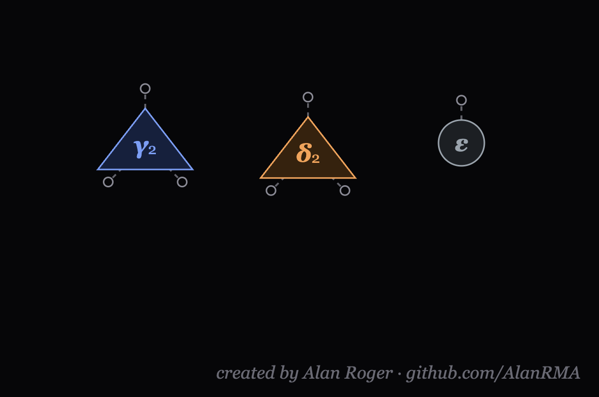
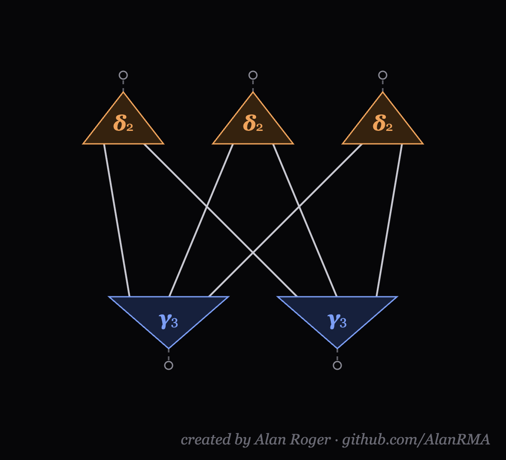
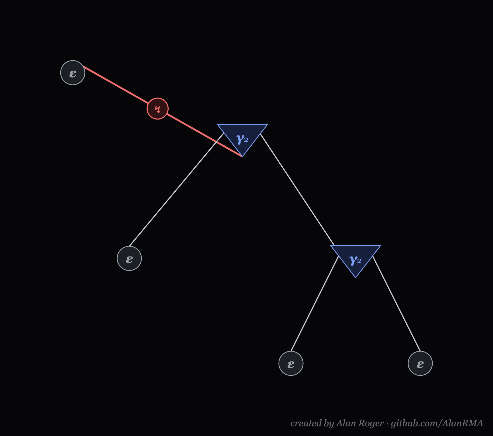
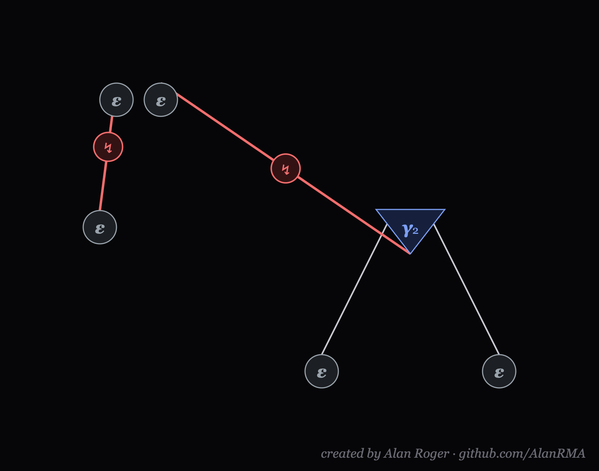
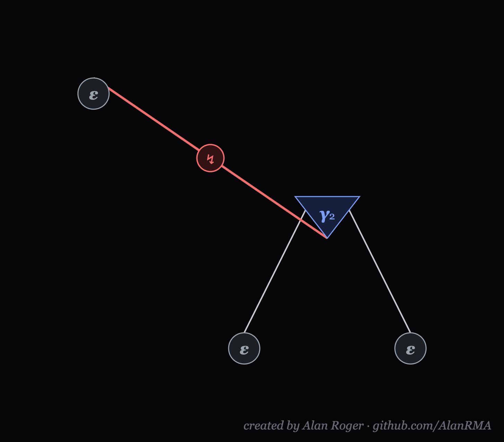
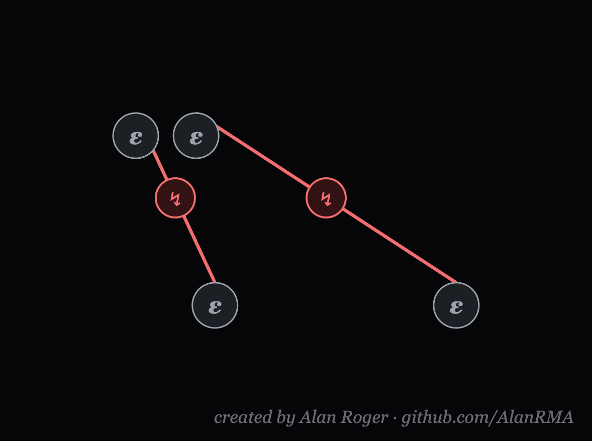
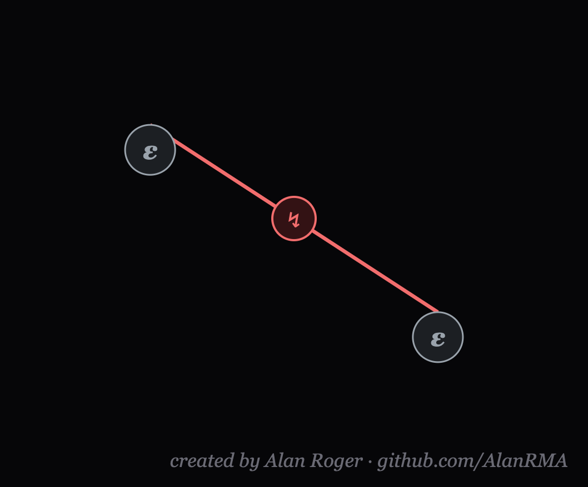

# Interaction Nets Sandbox

An interactive, in-browser playground to explore and play with **Interaction Nets**, based on Yves Lafont's interaction combinators. 

---

## Current Features

### 1. Classic Lafont Agents
The environment focuses on three fundamental agents, allowing the construction of complex logic from simple pieces:
* **γ (Gamma):** A constructor/duplicator agent with flexible arity (n auxiliary ports).
* **δ (Delta):** A secondary constructor/duplicator agent, also with flexible arity.
* **ε (Epsilon):** An eraser agent of arity 0.

### 2. Computation Engine (Reduction)
* **Active Pairs (Redexes):** Wires connecting two principal ports form active pairs (highlighted in red with a ↯ symbol).
* **Annihilation:** Occurs when two agents of the same type and arity interact.
* **Commutation:** Cross-duplication that happens when different agents (or agents of different arities) interact.
* **Erasure:** When any agent interacts with **ε**, it and all its connected branches are erased.

### 3. Execution Modes
* **Step (→):** Reduces one active pair at a time, ideal for debugging and learning.
* **Run (▸):** Animates the reduction continuously (every 160ms) until it reaches normal form.
* **All (⇒):** Processes thousands of reductions instantly in the background and renders only the final result on the screen.

### 4. Interface and Tools
* **Block Creation (Save Block ⧉):** Select a group of agents and package them as a reusable component (keeping the free ports as interfaces).
* **Presets and Local Cache:** Save the entire net to load later. All saved nets and blocks persist in the browser's `localStorage`.
* **Export (SVG/PNG):** Export the current net in vector format (lossless SVG) or as a high-resolution image (3x scaled PNG).
* **Event History:** A side panel logs each reduction step and notes which rewrite rule was applied (annihilation, erasure, commutation).
* **Structural Undo:** Classic shortcut (`Ctrl+Z` / `Cmd+Z`) to undo connections or node additions/deletions (stores the last 60 states).

---

## Possible Upcoming Additions

### 1. Enhanced Canvas Navigation & Naming
* **Document/Project Naming:** Add a feature to name the current canvas/document at the top of the screen. This will make it easier to organize saved workspaces and will automatically name the files when exporting to SVG or PNG.
* **Enable lables and notes in sandbox:** I just realized this one is important for prototype and let things clearer so I will implement soon.
* **Canvas Panning (Infinite Board):** Allow users to "grab" the empty background (using middle-click or spacebar + drag) to pan the camera around. This will give users an infinite canvas to build massive, complex nets without running out of screen space.
* **Zoom Controls:** Implement mouse-wheel zoom in/out to get a bird's-eye view of large computations or zoom in on specific redexes.

### 2. Mobile & Touch Support
* **Touch Gestures:** Fully support mobile devices and tablets by adding native touch gestures, such as two-finger panning to move the camera and pinch-to-zoom.
* **Mobile-Friendly UI:** Overhaul the layout for smaller screens, including collapsible sidebars, floating action buttons (FABs) for adding agents, and larger hitboxes for ports and wires to make touch interactions precise and comfortable.

### 3. Computation History (Time-Travel Debugging)
* **Undo Reductions (Step Back):** Currently, `Ctrl+Z` only undoes user actions (wiring, deleting, moving). The engine could be expanded to store a reversible history of the computations themselves.
* **Timeline Navigation:** Add "Step Back (←)" buttons to un-compute active pairs, tracking the network's topology exactly as it was before the rewrite rule was applied.

### 4. New Operators and Visual Upgrades
* **Arithmetic & Primitive Operators:** Addition of native numerical agents (e.g., Integer nodes) and arithmetic operators (`+`, `-`, `*`), as well as booleans and lists.
* **Visual Grouping (Black Box):** Allow saved blocks to be rendered on the main board as single compact "Boxes" (with hanging ports) to hide internal complexity. These could be "expanded" with a double-click.
* **Auto-Alignment (Snap to Grid):** An automatic alignment tool for wires and agents to keep diagrams perfectly organized.

---

## 🛠 How to Use

This project is 100% Client-Side and requires no servers or build tools.

1. Download the `index.html` file (or clone this repository).
2. Double-click the file or drag it into any modern web browser (Chrome, Firefox, Safari, Edge).
3. Read the welcome modal with quick instructions and start building your own computational nets!

---

## 📸 Examples in Action

*(Add your screenshots here by replacing the image paths)*

### Basic Wiring and Agents

these are the 3 unique combinators from Lafont

### Saving and Using Custom Blocks
Example of custom block

*Selecting a group of agents to save as a reusable block with free interface ports.*

### Computation (Step by Step)
You can run all, but just to illustrate the steps you can find:

step1:

step2:

step3:

step4:

step5:

---

**Created by Alan Roger** 

Feel free to copy, add features, and modify for both commercial and non-commercial purposes.

Credits are not required, but are appreciated.